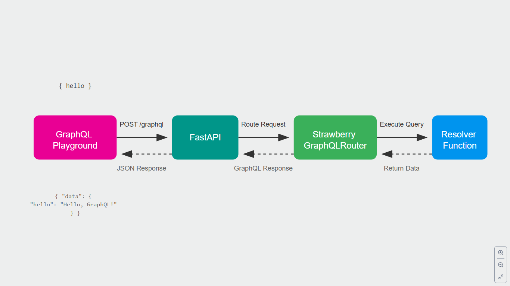

### Setting Up a Virtual Environment (venv) and Managing Dependencies

Here's how you can create and manage a virtual environment, as well as install packages from `requirements.txt`:

---

#### 1. **Creating a Virtual Environment**
Open your terminal and navigate to your project folder, then use the following command:
```bash
# For Unix/macOS
python3 -m venv venv

# For Windows
python -m venv venv
```
This command creates a folder named `venv` in your project directory, containing the virtual environment.

---

#### 2. **Activating the Virtual Environment**
- **On Unix/macOS:**
  ```bash
  source venv/bin/activate
  ```
- **On Windows (Command Prompt):**
  ```bash
  venv\Scripts\activate
  ```
- **On Windows (PowerShell):**
  ```bash
  .\venv\Scripts\Activate
  ```

---

#### 3. **Deactivating the Virtual Environment**
To deactivate your virtual environment, simply run:
```bash
deactivate
```

---

#### 4. **Installing Dependencies from `requirements.txt`**
Make sure your virtual environment is activated, then run:
```bash
pip install -r requirements.txt
```

This will install all the packages listed in `requirements.txt`.

---

### GraphQL Flow - Quick Notes

1. **GraphQL Playground**
   - Browser-based tool for testing GraphQL APIs
   - Access at `http://127.0.0.1:8000/graphql`
   - Used for sending queries & viewing responses

2. **Basic Query Flow**
   ```graphql
   {
     hello
   }
   ```

3. **Step-by-Step Process**
   a. **Request Initiation**
   - Query sent as HTTP POST to `/graphql` endpoint
   - FastAPI receives request

   b. **Processing**
   - FastAPI routes to GraphQLRouter
   - Strawberry parses query
   - Resolver function executes
   - Response formatted as JSON

   c. **Response Structure**
   ```json
   {
     "data": {
       "hello": "Hello, GraphQL with FastAPI!"
     }
   }
   ```

4. **Key Components**
   - FastAPI: Main server framework
   - Strawberry: GraphQL library
   - GraphQLRouter: Bridge between FastAPI & GraphQL
   - Resolver: Function handling the query

5. **Benefits**
   - Single endpoint (`/graphql`) for all requests
   - Interactive testing via Playground
   - Flexible data retrieval
   - Client controls data shape

6. **Integration Points**
   - Strawberry handles GraphQL logic
   - FastAPI provides server infrastructure
   - GraphQLRouter manages routing
   - All requests go through `/graphql` endpoint

